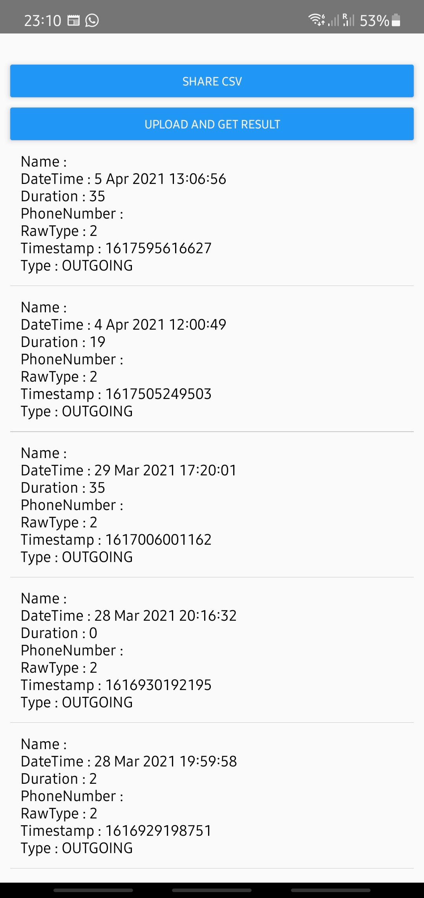

# CallExporter

An Android app built using React Native for exporting call log data to CSV. Be cautious about who you share this data as nothing is hidden/preserved for privacy. This is actual data exported from your mobile. 

# Instructions

- `git clone {repositoryLink}`
- Open AndroidStudio and launch an AVD. 
- Navigate to the project folder in your preferred terminal and  use `npm install`
- In this terminal, use `npx react-native start` to start the Metro Bundler to load the dependencies of the project and make them ready for usage. Leave this terminal open.
- Open another terminal window/tab, navigate to this project folder and use `npx react-native run-android` to run the app on the previously opened AVD.

# Generate APK

- To build an apk for this project, you need to have a keystore to sign the apk. 
- To do this, open a terminal and navigate to this project folder.
- `keytool -genkey -v -keystore debug.keystore -alias my-key-alias -keyalg RSA -keysize 2048 -validity 10000`
- The above command generates a keystore. Give all the details required as the prompt suggests and once it is complete, follow the next step.
- `cd android && ./gradlew assembleRelease` This command generates the apk in the path `ProjectDIR/android/app/build/outputs/apk/release/app-release.apk`

# Troubleshooting

- If `npx react-native run-android` fails and shows the error message `spawnSync ./gradlew EACCES`, navigate back to project folder and use `chmod 755 android/gradlew` to set proper permissions for gradelw

